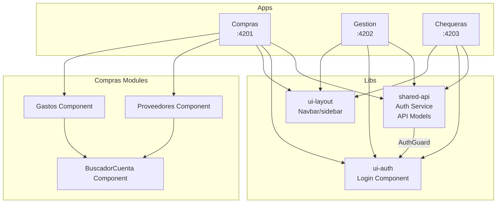

# UM Tesorería - Frontend Client

Sistema de gestión de tesorería construido con Angular 21 y Nx Workspace.

## Estructura del Proyecto

Este es un monorepo que contiene múltiples aplicaciones y librerías compartidas:

### Aplicaciones
- **compras** - Gestión de compras y proveedores (puerto 4201)
- **gestion** - Gestión administrativa (puerto 4202)
- **chequeras** - Gestión de chequeras (puerto 4203)

### Librerías
- `@tesoreria/shared-api` - Servicios API, autenticación y modelos compartidos
- `@tesoreria/ui-auth` - Componentes de interfaz para autenticación
- `@tesoreria/ui-layout` - Componentes de layout (navbar, sidebar)

## Requisitos

- Node.js >= 20
- npm 11.6.2

## Instalación

```bash
npm install
```

## Desarrollo

### Ejecutar todas las aplicaciones
```bash
npm run serve:all
```

### Ejecutar aplicación específica
```bash
nx serve compras
nx serve gestion
nx serve chequeras
```

### Construir
```bash
nx build
```

### Testing
```bash
nx test
```

## Arquitectura



## Tecnologías

| Tecnología | Versión |
|-----------|---------|
| Angular | 21.2.0 |
| Nx | 22.7.1 |
| Tailwind CSS | 4.2.4 |
| TypeScript | 5.9.2 |
| Vitest | 4.0.8 |
| Docker | 24-alpine (build) / nginx:alpine (runtime) |

## Despliegue con Docker

Cada aplicación incluye su propio Dockerfile con multi-stage build, soporte SSL/TLS con certificados auto-firmados y proxy inverso para rutas `/api/` hacia el servicio `tesoreria-gateway-service:8301`.

### Ejecutar contenedores
```bash
# Construir imagen para compras
docker build -f apps/compras/Dockerfile -t um-tesoreria-compras .

# Ejecutar contenedor (puertos 80 redirigen a 443)
docker run -p 8080:80 -p 8443:443 um-tesoreria-compras
```

### Características Docker
- **SSL/TLS**: Certificados auto-firmados generados al construir la imagen
- **Proxy Inverso**: Rutas `/api/` se redirigen al gateway de tesorería
- **Redirect**: HTTP (80) redirige automáticamente a HTTPS (443)

Aplicaciones disponibles:
- `apps/compras/Dockerfile` - Gestión de compras
- `apps/gestion/Dockerfile` - Gestión administrativa
- `apps/chequeras/Dockerfile` - Gestión de chequeras

## Versionado

Este proyecto sigue [Semantic Versioning](https://semver.org/).

Versión actual: **0.4.0**

## Licencia

Privado - UM Tesorería
