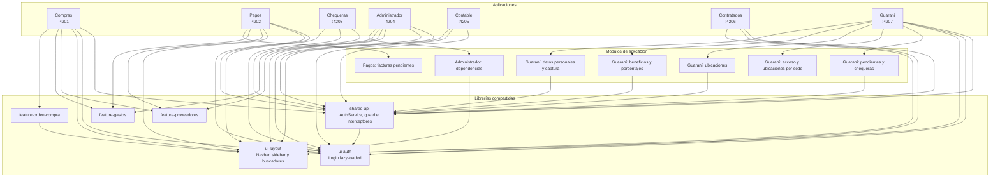

# UM Tesorería - Frontend Client

Sistema de gestión de tesorería construido con Angular 21 y Nx Workspace.

## Estructura del Proyecto

Este es un monorepo que contiene múltiples aplicaciones y librerías compartidas:

### Aplicaciones

- **compras** - Gestión de compras y proveedores (puerto 4201)
- **pagos** - Gestión de facturas pendientes (puerto 4202)
- **chequeras** - Gestión de chequeras (puerto 4203)
- **administrador** - Gestión administrativa (puerto 4204)
- **contable** - Módulo contable (puerto 4205)
- **contratados** - Gestión de contratados (puerto 4206)
- **guarani** - Gestión de pendientes, ubicaciones, beneficios y datos personales de Guaraní (puerto 4207)

### Librerías

- `@tesoreria/shared-api` - Servicios API, autenticación y modelos compartidos
- `@tesoreria/ui-auth` - Componentes de interfaz para autenticación
- `@tesoreria/ui-layout` - Componentes de layout (navbar, sidebar, buscador-cuenta-contable, buscador-proveedor)
- `@tesoreria/feature-proveedores` - Módulo compartido de proveedores (reutilizado por compras, administrador y pagos)
- `@tesoreria/feature-gastos` - Módulo compartido de gastos (reutilizado por compras, administrador y pagos)
- `@tesoreria/feature-orden-compra` - Módulo de órdenes de compra con dashboard, creación multi-paso y flujo de aprobación (integrado en compras)

La aplicación `guarani` también permite asociar tipos de chequera a propuestas, consultar el número de chequera y consultar o capturar datos personales de alumnos por documento.

## Requisitos

- Node.js >= 20
- npm 11.6.2

## Instalación

```bash
npm ci
```

## Desarrollo

### Ejecutar todas las aplicaciones

```bash
npm run serve:all
```

### Ejecutar aplicación específica

```bash
nx serve compras
nx serve pagos
nx serve chequeras
nx serve administrador
nx serve contable
nx serve contratados
nx serve guarani
```

### Construir

```bash
nx build
```

### Testing

```bash
nx test
```

## Arquitectura



## Tecnologías

| Tecnología   | Versión                                    |
| ------------ | ------------------------------------------ |
| Angular      | 21.2.0                                     |
| Nx           | 22.7.1                                     |
| Tailwind CSS | 4.2.4                                      |
| TypeScript   | 5.9.2                                      |
| Vitest       | 4.0.8                                      |
| Docker       | nginx:alpine (runtime)                     |

## Despliegue con Docker

Cada aplicación incluye un Dockerfile de runtime Nginx que sirve el artefacto generado por Nx, soporte SSL/TLS con certificados auto-firmados y proxy inverso para rutas `/api/` hacia el servicio `tesoreria-gateway-service:8301`.

### Ejecutar contenedores

```bash
# Construir primero el artefacto de producción
npx nx build compras --configuration=production

# Construir la imagen para compras
docker build -f apps/compras/Dockerfile -t um-tesoreria-compras .

# Ejecutar contenedor (puertos 80 redirigen a 443)
docker run -p 8080:80 -p 8443:443 um-tesoreria-compras
```

### Características Docker

- **SSL/TLS**: Certificados auto-firmados generados al construir la imagen
- **Proxy Inverso**: Rutas `/api/` se redirigen al gateway de tesorería
- **Redirect**: HTTP (80) redirige automáticamente a HTTPS (443)

Aplicaciones disponibles:

- `apps/compras/Dockerfile` - Gestión de compras
- `apps/pagos/Dockerfile` - Gestión de facturas pendientes
- `apps/chequeras/Dockerfile` - Gestión de chequeras
- `apps/administrador/Dockerfile` - Gestión administrativa
- `apps/contable/Dockerfile` - Módulo contable
- `apps/contratados/Dockerfile` - Gestión de contratados
- `apps/guarani/Dockerfile` - Gestión de Guaraní

## Versionado

Este proyecto sigue [Semantic Versioning](https://semver.org/).

Versión actual: **0.18.0**

## Licencia

Privado - UM Tesorería
