# UM Tesorería - Frontend Client

Sistema de gestión de tesorería construido con Angular 21 y Nx Workspace.

## Estructura del Proyecto

Este es un monorepo que contiene múltiples aplicaciones y librerías compartidas:

### Aplicaciones

- **compras** - Gestión de compras y proveedores (puerto 4201)
- **pagos** - Gestión de facturas pendientes (puerto 4202)
- **chequeras** - Gestión de chequeras (puerto 4203)
- **administrador** - Gestión administrativa (puerto 4204)
- **contable** - Módulo contable (puerto 4205)
- **contratados** - Gestión de contratados (puerto 4206)
- **guarani** - Gestión de pendientes, ubicaciones, beneficios y datos personales de Guaraní (puerto 4207)
- **externo-consulta** - Módulo de consulta para usuarios externos (puerto 4208): consulta del estado de chequeras de alumnos (por documento, apellido o número de chequera) en `/chequeras`

### Librerías

- `@tesoreria/shared-api` - Servicios API, autenticación y modelos compartidos
- `@tesoreria/ui-auth` - Componentes de interfaz para autenticación
- `@tesoreria/ui-layout` - Layout compartido: shell con sidebar J2 (`ui-shell`) y buscadores (buscador-cuenta-contable, buscador-proveedor)
- `@tesoreria/feature-proveedores` - Módulo compartido de proveedores (reutilizado por compras, administrador y pagos)
- `@tesoreria/feature-gastos` - Módulo compartido de gastos (reutilizado por compras, administrador y pagos)
- `@tesoreria/feature-orden-compra` - Módulo de órdenes de compra con dashboard, creación multi-paso y flujo de aprobación (integrado en compras)

La aplicación `guarani` también permite asociar tipos de chequera a propuestas, consultar el número de chequera y consultar o capturar datos personales de alumnos por documento.

## Requisitos

- Node.js >= 20
- npm 11.6.2

## Instalación

```bash
npm ci
```

## Desarrollo

### Ejecutar todas las aplicaciones

```bash
npm run serve:all
```

### Ejecutar aplicación específica

```bash
nx serve compras
nx serve pagos
nx serve chequeras
nx serve administrador
nx serve contable
nx serve contratados
nx serve guarani
nx serve externo-consulta
```

### Construir

```bash
nx build
```

### Testing

```bash
nx test
```

Con Node 25 o superior, el `localStorage` nativo de Node tapa al de jsdom y fallan los tests que construyen `AuthService`. Para correrlos localmente como en la CI (Node 20):

```bash
NODE_OPTIONS=--no-webstorage nx test externo-consulta
```

### Probar externo-consulta localmente

`environment.development.ts` usa `BACKEND_URL_PLACEHOLDER/core/auth` como ruta relativa: `nx serve` necesita un proxy que la reenvíe al gateway. El script de preview de Conductor (`externo-consulta`) levanta Consul, el gateway y el core en Docker (Colima) y ejecuta `nx serve externo-consulta --proxy-config .conductor/proxy.json`, que mapea `/BACKEND_URL_PLACEHOLDER` → `http://127.0.0.1:8301/api/tesoreria`. Para usar la vista `/chequeras`:

1. Tener el gateway en el puerto 8301 y un core que incluya `GET chequeraSerie/usuario/{userId}/lectivo/{lectivoId}` y el alias `api/tesoreria/core/documento`.
2. Usar un usuario que tenga filas en `usuario_chequera_facultad`. Sin facultades asignadas, la vista muestra "Su usuario no tiene facultades asignadas".
3. Para probar los endpoints con curl, obtener un token:

```bash
TOKEN=$(curl -s -X POST http://localhost:8301/api/tesoreria/core/auth/login \
  -H 'Content-Type: application/json' -d '{"login":"<usuario>","password":"<clave>"}' | jq -r .token)
BASE=http://localhost:8301/api/tesoreria/core
curl -s -H "Authorization: Bearer $TOKEN" $BASE/usuarioChequeraFacultad/user/<userId>
curl -s -H "Authorization: Bearer $TOKEN" "$BASE/chequeraSerie/usuario/<userId>/lectivo/<lectivoId>?personaId=<dni>&documentoId=<id>&page=0&size=100"
curl -s -H "Authorization: Bearer $TOKEN" $BASE/chequera/cuotas/pagos/<facultadId>/<tipoChequeraId>/<chequeraSerieId>/<alternativaId>
curl -s -H "Authorization: Bearer $TOKEN" $BASE/chequeraCuota/deuda/<facultadId>/<tipoChequeraId>/<chequeraSerieId>
```

El filtro por facultad lo aplica el core con el `userId` que manda el frontend, pero hoy nadie verifica que ese `userId` sea el de la sesión. No es control de acceso: la vista no debe exponerse a usuarios externos reales hasta que el gateway vincule el `userId` a la sesión.

## Arquitectura

```mermaid
    flowchart TB
    subgraph Apps["Aplicaciones"]
        C["Compras<br/>:4201"]
        P["Pagos<br/>:4202"]
        Q["Chequeras<br/>:4203"]
        A["Administrador<br/>:4204"]
        CT["Contable<br/>:4205"]
        CR["Contratados<br/>:4206"]
        G["Guaraní<br/>:4207"]
        EC["Externo Consulta<br/>:4208"]
    end

    subgraph Modules["Módulos de aplicación"]
        FP["Pagos: facturas pendientes"]
        DEP["Administrador: dependencias"]
        GP["Guaraní: pendientes y chequeras"]
        GS["Guaraní: acceso y ubicaciones por sede"]
        GU["Guaraní: ubicaciones"]
        GB["Guaraní: beneficios y porcentajes"]
        GD["Guaraní: datos personales y captura"]
    end

    subgraph Libs["Librerías compartidas"]
        API["shared-api<br/>AuthService, guard e interceptores"]
        AUTH["ui-auth<br/>Login lazy-loaded"]
        LAYOUT["ui-layout<br/>Shell J2 y buscadores"]
        FPROV["feature-proveedores"]
        FGAST["feature-gastos"]
        ORDCOMPRA["feature-orden-compra"]
    end

    C --> API
    C --> AUTH
    C --> LAYOUT
    C --> FPROV
    C --> FGAST
    C --> ORDCOMPRA
    ORDCOMPRA --> LAYOUT

    P --> API
    P --> AUTH
    P --> LAYOUT
    P --> FPROV
    P --> FGAST
    P --> FP

    Q --> API
    Q --> AUTH
    Q --> LAYOUT

    A --> API
    A --> AUTH
    A --> LAYOUT
    A --> FPROV
    A --> FGAST
    A --> DEP
    DEP --> LAYOUT

    CT --> API
    CT --> AUTH
    CT --> LAYOUT

    CR --> API
    CR --> AUTH
    CR --> LAYOUT

    G --> API
    G --> AUTH
    G --> LAYOUT
    G --> GP
    G --> GS
    G --> GU
    G --> GB
    G --> GD
    GP --> API
    GU --> API
    GB --> API
    GD --> API

    EC --> API
    EC --> AUTH
    EC --> LAYOUT

    API --> AUTH
```



## Sistema de Diseño (J2)

Todas las aplicaciones comparten el tema visual **J2** (dirección J2), definido en
`libs/ui-layout/src/styles/tokens.css` e importado por cada `apps/<app>/src/styles.css`:

- **Tokens**: paleta `um-*` (p. ej. `bg-um-sidebar`, `text-um-ink`, `border-um-border`), tipografía, espaciados y radios. Es la única fuente de colores: no agregar hex sueltos en templates.
- **Shell**: `<ui-shell moduleName="..." [menuItems]="...">` (`@tesoreria/ui-layout`) aporta sidebar oscuro, badge de entorno con color por ambiente, usuario, logout y layout responsive. Las apps solo definen marca y menú.
- **Utilidades de componentes**: clases en `@layer components` para patrones repetidos: `.um-page-header`, `.um-eyebrow`, `.um-page-title`, `.um-label`, `.um-input` (`.um-input-invalid`), `.um-btn-primary`, `.um-btn-secondary`, `.um-link-btn`, `.um-alert` (+ `-error/-warn/-success`), `.um-card`, `.um-badge`, `.um-table`.
- **Referencia viva**: la vista `apps/externo-consulta/src/app/chequeras` es el piloto del diseño; usarla como modelo para nuevas pantallas.

## Tecnologías

| Tecnología   | Versión                |
| ------------ | ---------------------- |
| Angular      | 21.2.0                 |
| Nx           | 22.7.1                 |
| Tailwind CSS | 4.2.4                  |
| TypeScript   | 5.9.2                  |
| Vitest       | 4.0.8                  |
| Docker       | nginx:alpine (runtime) |

## Despliegue con Docker

Cada aplicación incluye un Dockerfile de runtime Nginx que sirve el artefacto generado por Nx, soporte SSL/TLS con certificados auto-firmados y proxy inverso para rutas `/api/` hacia el servicio `tesoreria-gateway-service:8301`.

### Ejecutar contenedores

```bash
# Construir primero el artefacto de producción
npx nx build compras --configuration=production

# Construir la imagen para compras
docker build -f apps/compras/Dockerfile -t um-tesoreria-compras .

# Ejecutar contenedor (puertos 80 redirigen a 443)
docker run -p 8080:80 -p 8443:443 um-tesoreria-compras
```

### Características Docker

- **SSL/TLS**: Certificados auto-firmados generados al construir la imagen
- **Proxy Inverso**: Rutas `/api/` se redirigen al gateway de tesorería
- **Redirect**: HTTP (80) redirige automáticamente a HTTPS (443)

Aplicaciones disponibles:

- `apps/compras/Dockerfile` - Gestión de compras
- `apps/pagos/Dockerfile` - Gestión de facturas pendientes
- `apps/chequeras/Dockerfile` - Gestión de chequeras
- `apps/administrador/Dockerfile` - Gestión administrativa
- `apps/contable/Dockerfile` - Módulo contable
- `apps/contratados/Dockerfile` - Gestión de contratados
- `apps/guarani/Dockerfile` - Gestión de Guaraní
- `apps/externo-consulta/Dockerfile` - Consulta externa

## Versionado

Este proyecto sigue [Semantic Versioning](https://semver.org/).

Versión actual: **0.21.0**

## Licencia

Privado - UM Tesorería
