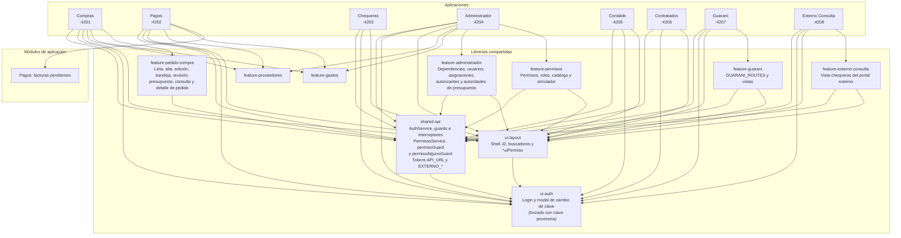

# UM Tesorería - Frontend Client

Sistema de gestión de tesorería construido con Angular 21 y Nx Workspace.

## Estructura del Proyecto

Este es un monorepo que contiene múltiples aplicaciones y librerías compartidas:

### Aplicaciones

- **compras** - Gestión de compras y proveedores (puerto 4201)
- **pagos** - Gestión de facturas pendientes (puerto 4202)
- **chequeras** - Gestión de chequeras (puerto 4203)
- **administrador** - Gestión administrativa (puerto 4204)
- **contable** - Módulo contable (puerto 4205)
- **contratados** - Gestión de contratados (puerto 4206)
- **guarani** - Gestión de pendientes, ubicaciones, beneficios y datos personales de Guaraní (puerto 4207)
- **externo-consulta** - Módulo de consulta para usuarios externos (puerto 4208): consulta del estado de chequeras de alumnos (por documento, apellido o número de chequera) en `/chequeras`

### Librerías

- `@tesoreria/shared-api` - Servicios API, autenticación, permisos y modelos compartidos (`PermisosService`, `permisoGuard` y `permisoAlgunoGuard`)
- `@tesoreria/ui-auth` - Componentes de interfaz para autenticación
- `@tesoreria/ui-layout` - Layout compartido: shell con sidebar J2 (`ui-shell`), buscadores (buscador-cuenta-contable, buscador-proveedor, buscador-persona) y la directiva `*uiPermiso`
- `@tesoreria/feature-proveedores` - Módulo compartido de proveedores (reutilizado por compras, administrador y pagos)
- `@tesoreria/feature-gastos` - Módulo compartido de gastos (reutilizado por compras, administrador y pagos)
- `@tesoreria/feature-pedido-compra` - Módulo de pedidos de compra (lista, alta, edición, bandeja de envío, revisión de compras, autorización de presupuesto, consulta y detalle) montado por la app compras en `/pedido`
- `@tesoreria/feature-administrador` - Módulo administrativo: dependencias, usuarios, asignaciones de usuario, autorizantes de envío y autoridades de presupuesto
- `@tesoreria/feature-permisos` - Seguridad del core: `/permisos`, `/roles`, `/catalogo` y `/simulador` (app administrador)
- `@tesoreria/feature-guarani` - Módulo Guaraní: rutas (`GUARANI_ROUTES`), pendientes, ubicaciones, beneficios, datos personales y su guard de sede principal, montado por la app guarani con `loadChildren`
- `@tesoreria/feature-externo-consulta` - Módulo del portal externo: vista `/chequeras` (componente, store, service y utilidades), montada por la app externo-consulta con `loadComponent`

La aplicación `guarani` también permite asociar tipos de chequera a propuestas, consultar el número de chequera y consultar o capturar datos personales de alumnos buscándolos por apellido y nombre o por número de documento.

## Requisitos

- Node.js >= 20
- npm 11.6.2

## Instalación

```bash
npm ci
```

## Desarrollo

### Ejecutar todas las aplicaciones

```bash
npm run serve:all
```

### Ejecutar aplicación específica

```bash
nx serve compras
nx serve pagos
nx serve chequeras
nx serve administrador
nx serve contable
nx serve contratados
nx serve guarani
nx serve externo-consulta
```

### Construir

```bash
nx build
```

### Testing

```bash
nx test
```

Con Node 25 o superior, el `localStorage` nativo de Node tapa al de jsdom y fallan los tests que construyen `AuthService`. Para correrlos localmente como en la CI (Node 20):

```bash
NODE_OPTIONS=--no-webstorage nx test externo-consulta
```

### Probar externo-consulta localmente

`environment.development.ts` usa `BACKEND_URL_PLACEHOLDER/core/auth` como ruta relativa: `nx serve` necesita un proxy que la reenvíe al gateway. El script de preview de Conductor (`externo-consulta`) levanta Consul, el gateway y el core en Docker (Colima) y ejecuta `nx serve externo-consulta --proxy-config .conductor/proxy.json`, que mapea `/BACKEND_URL_PLACEHOLDER` → `http://127.0.0.1:8301/api/tesoreria`. Para usar la vista `/chequeras`:

El script de preview no levanta `report`: hay que iniciarlo por separado para descargar el PDF. La versión nueva de `report` requiere además que el core exponga `GET chequera/estado/{facultadId}/{tipoChequeraId}/{chequeraSerieId}/{alternativaId}`.

1. Tener el gateway en el puerto 8301 —incluido el servicio `report`, que sirve el "Estado (PDF)" vía `GET report/chequeras/estado/facultad/{facultadId}/tipoChequera/{tipoChequeraId}/chequeraSerie/{chequeraSerieId}/alternativa/{alternativaId}` e incluye los débitos automáticos de todos los tipos— y un core que incluya `GET chequeraSerie/usuario/{userId}/lectivo/{lectivoId}/asignaciones`, `GET usuarioChequeraGeografica/user/{userId}`, `GET usuarioChequeraClaseChequera/user/{userId}` y el alias `api/tesoreria/core/documento`.
2. Usar un usuario que tenga filas en las tres tablas de asignaciones: `usuario_chequera_facultad`, `usuario_chequera_geografica` y `usuario_chequera_clase_chequera`. Sin asignaciones en alguna dimensión, la vista muestra "Su usuario no tiene facultades/sedes/clases de chequera asignadas para consultar chequeras" (la primera dimensión faltante, con prioridad facultad > sede > clase).
3. Para probar los endpoints con curl, obtener un token:

```bash
TOKEN=$(curl -s -X POST http://localhost:8301/api/tesoreria/core/auth/login \
  -H 'Content-Type: application/json' -d '{"login":"<usuario>","password":"<clave>"}' | jq -r .token)
BASE=http://localhost:8301/api/tesoreria/core
curl -s -H "Authorization: Bearer $TOKEN" $BASE/usuarioChequeraFacultad/user/<userId>
curl -s -H "Authorization: Bearer $TOKEN" $BASE/usuarioChequeraGeografica/user/<userId>
curl -s -H "Authorization: Bearer $TOKEN" $BASE/usuarioChequeraClaseChequera/user/<userId>
curl -s -H "Authorization: Bearer $TOKEN" "$BASE/chequeraSerie/usuario/<userId>/lectivo/<lectivoId>/asignaciones?personaId=<dni>&documentoId=<id>&page=0&size=100"
curl -s -H "Authorization: Bearer $TOKEN" $BASE/chequera/cuotas/pagos/<facultadId>/<tipoChequeraId>/<chequeraSerieId>/<alternativaId>
curl -s -H "Authorization: Bearer $TOKEN" $BASE/chequeraCuota/deuda/<facultadId>/<tipoChequeraId>/<chequeraSerieId>
```

El filtro por las asignaciones (facultad, sede geográfica y clase de chequera) lo aplica el core con el `userId` que manda el frontend, pero hoy nadie verifica que ese `userId` sea el de la sesión. El frontend suma una red de seguridad local: el store descarta de la vista las chequeras cuya facultad o sede no estén entre los catálogos cargados con el usuario de la sesión (la clase no puede validarse en el cliente). Aun así no es control de acceso: la vista no debe exponerse a usuarios externos reales hasta que el gateway vincule el `userId` a la sesión.

## Arquitectura


```mermaid
    flowchart TB
    subgraph Apps["Aplicaciones"]
        C["Compras<br/>:4201"]
        P["Pagos<br/>:4202"]
        Q["Chequeras<br/>:4203"]
        A["Administrador<br/>:4204"]
        CT["Contable<br/>:4205"]
        CR["Contratados<br/>:4206"]
        G["Guaraní<br/>:4207"]
        EC["Externo Consulta<br/>:4208"]
    end

    subgraph Modules["Módulos de aplicación"]
        FP["Pagos: facturas pendientes"]
    end

    subgraph Libs["Librerías compartidas"]
        API["shared-api<br/>AuthService, guards e interceptores<br/>PermisosService, permisoGuard<br/>y permisoAlgunoGuard<br/>Tokens API_URL y EXTERNO_*"]
        AUTH["ui-auth<br/>Login y modal de cambio de clave<br/>(forzado con clave provisoria)"]
        LAYOUT["ui-layout<br/>Shell J2, buscadores y *uiPermiso"]
        FPROV["feature-proveedores"]
        FGAST["feature-gastos"]
        FPED["feature-pedido-compra<br/>Lista, alta, edición, bandeja, revisión,<br/>presupuesto, consulta y detalle de pedido"]
        FADM["feature-administrador<br/>Dependencias, usuarios, asignaciones,<br/>autorizantes y autoridades de presupuesto"]
        FPERM["feature-permisos<br/>Permisos, roles, catálogo y simulador"]
        FGUAR["feature-guarani<br/>GUARANI_ROUTES y vistas"]
        FEXT["feature-externo-consulta<br/>Vista chequeras del portal externo"]
    end

    C --> API
    C --> AUTH
    C --> LAYOUT
    C --> FPROV
    C --> FGAST
    C --> FPED
    FPED --> API

    P --> API
    P --> AUTH
    P --> LAYOUT
    P --> FPROV
    P --> FGAST
    P --> FP

    Q --> API
    Q --> AUTH
    Q --> LAYOUT

    A --> API
    A --> AUTH
    A --> LAYOUT
    A --> FPROV
    A --> FGAST
    A --> FADM
    A --> FPERM
    FADM --> API
    FADM --> LAYOUT
    FPERM --> API
    FPERM --> LAYOUT

    CT --> API
    CT --> AUTH
    CT --> LAYOUT

    CR --> API
    CR --> AUTH
    CR --> LAYOUT

    G --> API
    G --> AUTH
    G --> LAYOUT
    G --> FGUAR
    FGUAR --> API
    FGUAR --> LAYOUT

    EC --> API
    EC --> AUTH
    EC --> LAYOUT
    EC --> FEXT
    FEXT --> API
    FEXT --> LAYOUT

    LAYOUT --> AUTH
    API --> AUTH
```

## Sistema de Diseño (J2)

Todas las aplicaciones comparten el tema visual **J2** (dirección J2), definido en
`libs/ui-layout/src/styles/tokens.css` e importado por cada `apps/<app>/src/styles.css`:

- **Tokens**: paleta `um-*` (p. ej. `bg-um-sidebar`, `text-um-ink`, `border-um-border`), tipografía, espaciados y radios. Es la única fuente de colores: no agregar hex sueltos en templates.
- **Shell**: `<ui-shell moduleName="..." [menuItems]="...">` (`@tesoreria/ui-layout`) aporta sidebar oscuro, badge de entorno con color por ambiente, usuario, logout y layout responsive. Las apps solo definen marca y menú.
- **Permisos**: los ítems del menú con `permiso` y las acciones con `*uiPermiso="'modulo.accion'"` sólo se muestran si el bundle efectivo del usuario (`PermisosService`, convención `modulo.accion`) incluye la clave; sin backend o ante error el bundle queda vacío (fail-closed). Las rutas se protegen con `permisoGuard('<clave>')` o, en vistas compartidas por varios roles, con `permisoAlgunoGuard(['<clave>', ...])` (autoriza con al menos una).
- **Utilidades de componentes**: clases en `@layer components` para patrones repetidos: `.um-page-header`, `.um-eyebrow`, `.um-page-title`, `.um-label`, `.um-input` (`.um-input-invalid`), `.um-btn-primary`, `.um-btn-secondary`, `.um-link-btn`, `.um-alert` (+ `-error/-warn/-success`), `.um-card`, `.um-badge`, `.um-table`.
- **Referencia viva**: la vista `libs/feature-externo-consulta/src/lib/chequeras` es el piloto del diseño; usarla como modelo para nuevas pantallas.

## Tecnologías

| Tecnología   | Versión                       |
| ------------ | ----------------------------- |
| Angular      | 21.2.0                        |
| Nx           | 22.7.1                        |
| Tailwind CSS | 4.2.4                         |
| TypeScript   | 5.9.2                         |
| Vitest       | 4.0.8                         |
| Docker       | node:24-alpine + nginx:alpine |

## Despliegue con Docker

`docker/app.Dockerfile` es un **único Dockerfile multistage** para las ocho aplicaciones: una etapa `node:24-alpine` que corre `npm ci` y `npx nx build <app> --configuration=production`, y una etapa `nginx:alpine` que sirve ese resultado con SSL/TLS auto-firmado y proxy inverso de `/api/` hacia `tesoreria-gateway-service:8301`. La aplicación se selecciona con el build argument `APP`.

La imagen depende exclusivamente del código fuente: el `dist/apps/` del disco es irrelevante. El Dockerfile anterior era sólo runtime (`COPY dist/apps/<app>/browser`) y, si el `nx build` no se volvía a correr, la imagen reconstruida seguía sirviendo el bundle anterior sin ningún aviso.

### Reconstruir la imagen de una aplicación

```bash
# Recomendado: usa el compose del stack (mismo nombre de imagen y red) y siempre recompila
npm run docker:app -- compras

# Equivalente manual (LOCAL_RESOURCE apunta a la raíz que contiene workspaces/)
docker compose up -d --build tesoreria-compras-client

# Sin Compose, imagen suelta
docker build -f docker/app.Dockerfile --build-arg APP=compras -t um-tesoreria-compras-client .
```

`--build` no es opcional con Compose: `docker compose up -d` a secas reutiliza la imagen existente y no comprueba si el código cambió. El script `npm run docker:app` ya lo incluye.

El `.dockerignore` es obligatorio para que esto sea rápido: sin él Docker enviaría ~1 GB de `node_modules`, `dist`, `.angular` y `.nx` como contexto, y el `COPY . .` de la etapa de compilación pisaría el `node_modules` instalado con binarios de otra plataforma.

### Características Docker

- **Multistage**: la compilación ocurre dentro de la imagen, en `node:24-alpine`
- **SSL/TLS**: Certificados auto-firmados generados al construir la imagen
- **Proxy Inverso**: Rutas `/api/` se redirigen al gateway de tesorería
- **Redirect**: HTTP (80) redirige automáticamente a HTTPS (443)

Aplicaciones disponibles (todas vía `--build-arg APP=<nombre>`):

- `compras` - Gestión de compras
- `pagos` - Gestión de facturas pendientes
- `chequeras` - Gestión de chequeras
- `administrador` - Gestión administrativa
- `contable` - Módulo contable
- `contratados` - Gestión de contratados
- `guarani` - Gestión de Guaraní
- `externo-consulta` - Consulta externa

## Versionado

Este proyecto sigue [Semantic Versioning](https://semver.org/).

Versión actual: **0.30.0**

## Licencia

Privado - UM Tesorería
