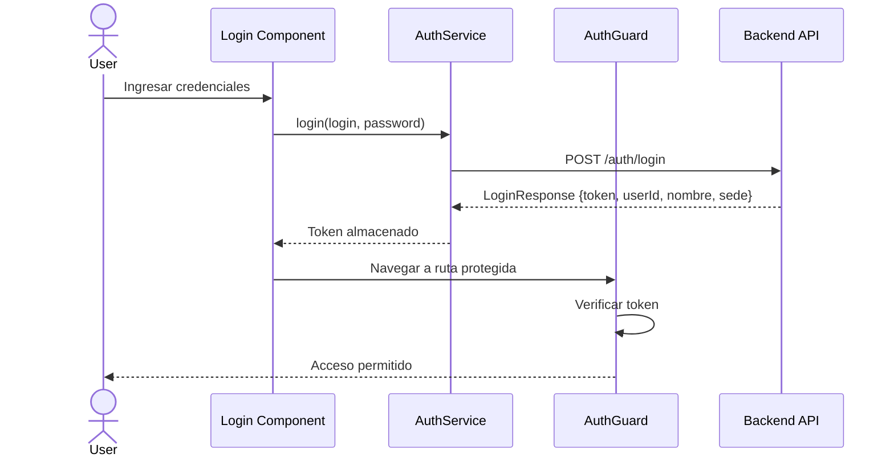
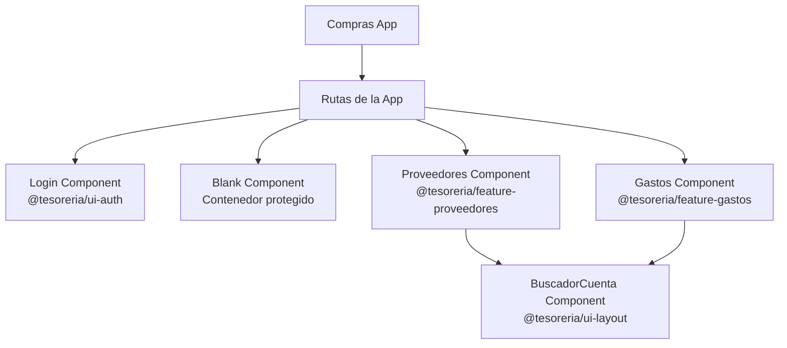
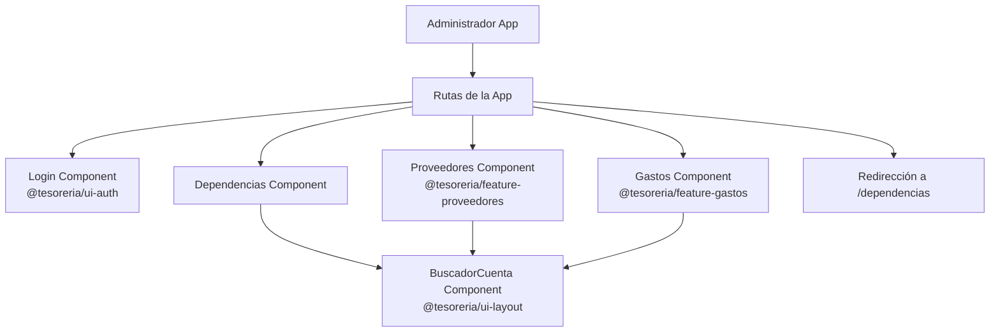
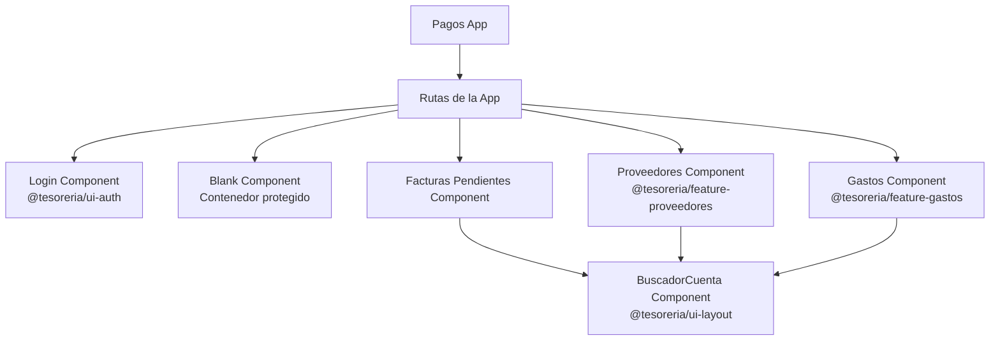
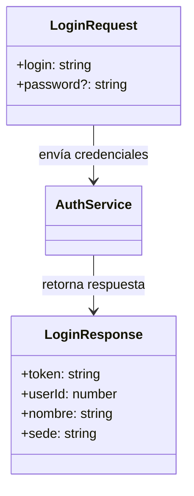

# Arquitectura del Sistema

## Diagrama de Componentes

```mermaid
graph LR
    subgraph "Frontend Client"
        subgraph "Apps"
            Compras[Compras App<br/>:4201]
            Pagos[Pagos App<br/>:4202]
            Chequeras[Chequeras App<br/>:4203]
            Admin[Administrador App<br/>:4204]
            Contable[Contable App<br/>:4205]
            Contratados[Contratados App<br/>:4206]
        end

        subgraph "Libraries"
            SharedAPI[@tesoreria/shared-api<br/>AuthService<br/>AuthGuard<br/>Models]
            UIAuth[@tesoreria/ui-auth<br/>LoginComponent]
            UILayout[@tesoreria/ui-layout<br/>NavbarComponent<br/>SidebarComponent<br/>BuscadorCuentaComponent]
            FeatureProveedores[@tesoreria/feature-proveedores<br/>ProveedoresComponent]
            FeatureGastos[@tesoreria/feature-gastos<br/>GastosComponent]
        end
    end

    Compras --> SharedAPI
    Compras --> UIAuth
    Compras --> UILayout
    Compras --> FeatureProveedores
    Compras --> FeatureGastos

    Pagos --> SharedAPI
    Pagos --> UIAuth
    Pagos --> UILayout
    Pagos --> FeatureProveedores
    Pagos --> FeatureGastos

    Chequeras --> SharedAPI
    Chequeras --> UIAuth
    Chequeras --> UILayout

    Admin --> SharedAPI
    Admin --> UIAuth
    Admin --> UILayout
    Admin --> FeatureProveedores
    Admin --> FeatureGastos

    Contable --> SharedAPI
    Contable --> UIAuth
    Contable --> UILayout

    Contratados --> SharedAPI
    Contratados --> UIAuth
    Contratados --> UILayout

    SharedAPI -->|HTTP| BackendAPI[Backend API<br/>Tesorería]
```

## Flujo de Autenticación



## Estructura de Módulos - Compras



## Estructura de Módulos - Administrador



## Estructura de Módulos - Pagos



## Modelos de Datos - Autenticación


