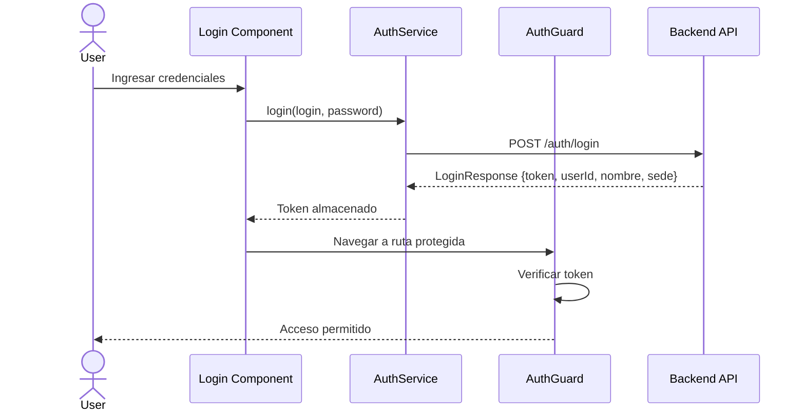
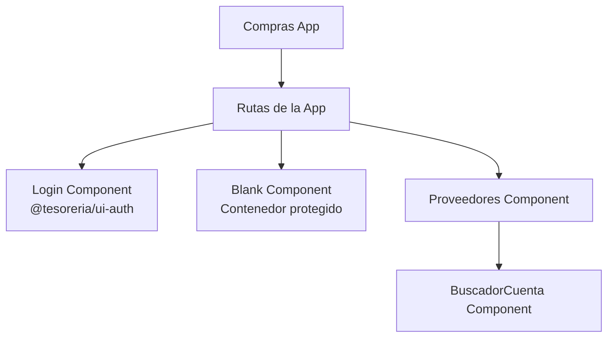
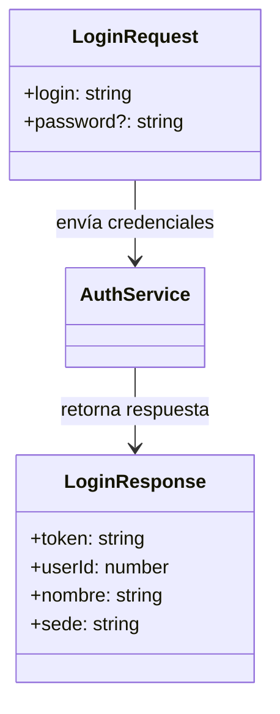

# Arquitectura del Sistema

## Diagrama de Componentes

```mermaid
graph LR
    subgraph "Frontend Client"
        subgraph "Apps"
            Compras[Compras App<br/>:4201]
            Gestion[Gestion App<br/>:4202]
            Chequeras[Chequeras App<br/>:4203]
        end

        subgraph "Libraries"
            SharedAPI[@tesoreria/shared-api<br/>AuthService<br/>AuthGuard<br/>Models]
            UIAuth[@tesoreria/ui-auth<br/>LoginComponent]
            UILayout[@tesoreria/ui-layout<br/>NavbarComponent<br/>SidebarComponent]
        end
    end

    Compras --> SharedAPI
    Compras --> UIAuth
    Compras --> UILayout

    Gestion --> SharedAPI
    Gestion --> UIAuth
    Gestion --> UILayout

    Chequeras --> SharedAPI
    Chequeras --> UIAuth
    Chequeras --> UILayout

    SharedAPI -->|HTTP| BackendAPI[Backend API<br/>Tesorería]
```

## Flujo de Autenticación



## Estructura de Módulos - Compras



## Modelos de Datos - Autenticación


