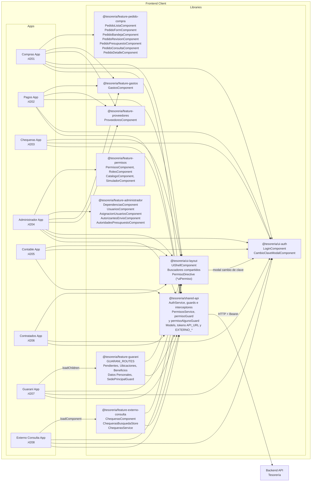
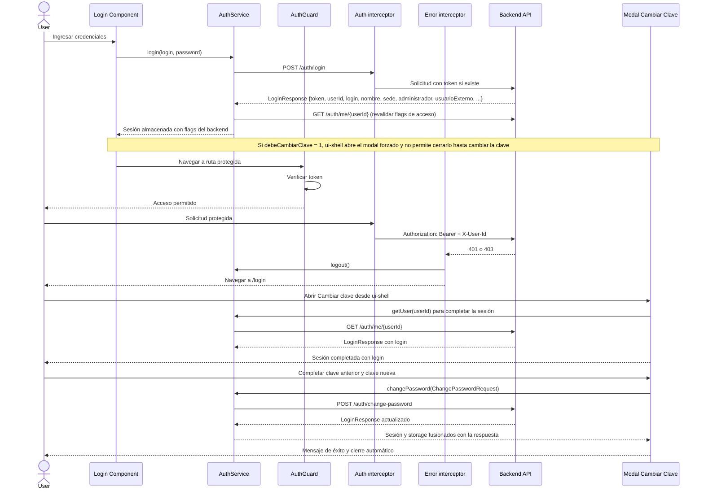
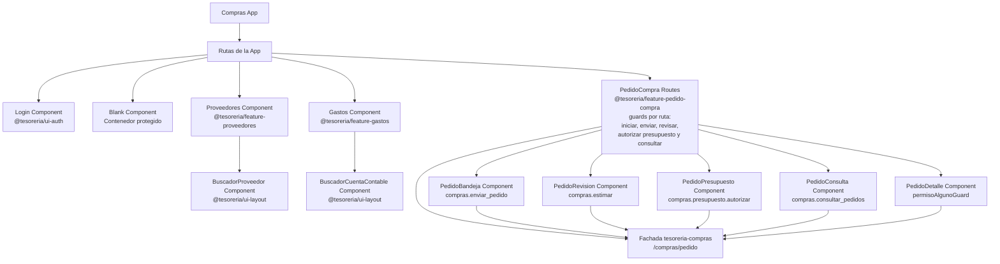
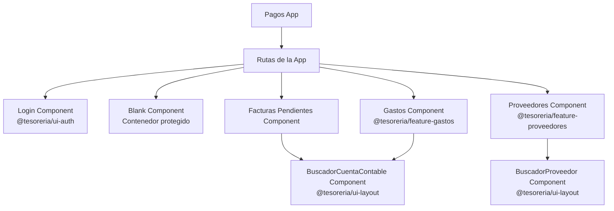
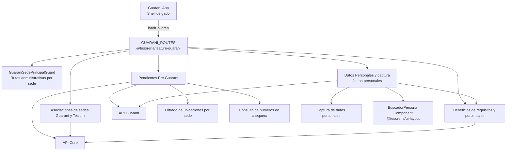
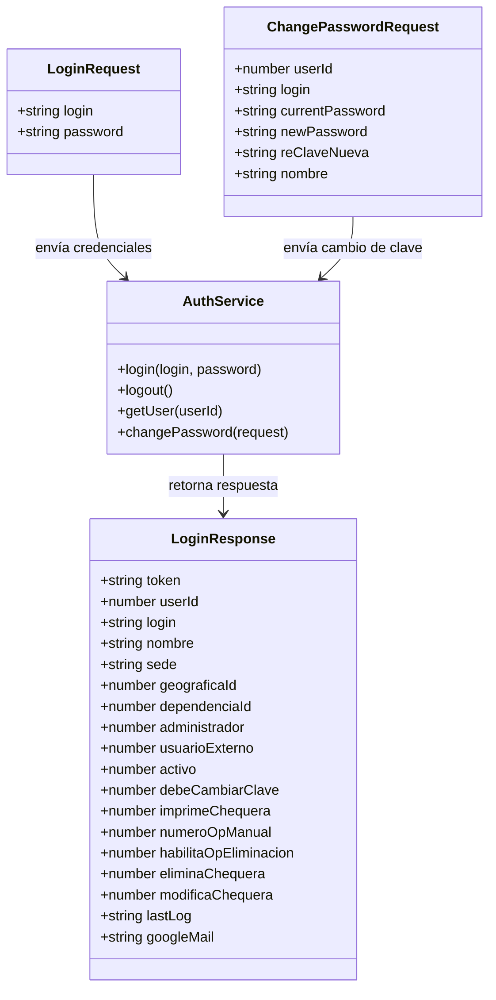

# Arquitectura del Sistema

## Diagrama de Componentes

```mermaid
    flowchart LR
    subgraph "Frontend Client"
        subgraph "Apps"
            Compras["Compras App<br/>:4201"]
            Pagos["Pagos App<br/>:4202"]
            Chequeras["Chequeras App<br/>:4203"]
            Admin["Administrador App<br/>:4204"]
            Contable["Contable App<br/>:4205"]
            Contratados["Contratados App<br/>:4206"]
            Guarani["Guaraní App<br/>:4207"]
            ExternoConsulta["Externo Consulta App<br/>:4208"]
        end

        subgraph "Libraries"
            SharedAPI["@tesoreria/shared-api<br/>AuthService, guards e interceptores<br/>PermisosService, permisoGuard<br/>y permisoAlgunoGuard<br/>Models, tokens API_URL y EXTERNO_*"]
            UIAuth["@tesoreria/ui-auth<br/>LoginComponent<br/>CambioClaveModalComponent"]
            UILayout["@tesoreria/ui-layout<br/>UiShellComponent<br/>Buscadores compartidos<br/>PermisoDirective (*uiPermiso)"]
            FeatureProveedores["@tesoreria/feature-proveedores<br/>ProveedoresComponent"]
            FeatureGastos["@tesoreria/feature-gastos<br/>GastosComponent"]
            FeaturePedidoCompra["@tesoreria/feature-pedido-compra<br/>PedidoListaComponent<br/>PedidoFormComponent<br/>PedidoBandejaComponent<br/>PedidoRevisionComponent<br/>PedidoPresupuestoComponent<br/>PedidoConsultaComponent<br/>PedidoDetalleComponent"]
            FeatureAdministrador["@tesoreria/feature-administrador<br/>DependenciasComponent<br/>UsuariosComponent<br/>AsignacionUsuariosComponent<br/>AutorizantesEnvioComponent<br/>AutoridadesPresupuestoComponent"]
            FeaturePermisos["@tesoreria/feature-permisos<br/>PermisosComponent, RolesComponent<br/>CatalogoComponent, SimuladorComponent"]
            FeatureGuarani["@tesoreria/feature-guarani<br/>GUARANI_ROUTES<br/>Pendientes, Ubicaciones, Beneficios<br/>Datos Personales, SedePrincipalGuard"]
            FeatureExterno["@tesoreria/feature-externo-consulta<br/>ChequerasComponent<br/>ChequerasBusquedaStore<br/>ChequerasService"]
        end
    end

    Compras --> SharedAPI
    Compras --> UIAuth
    Compras --> UILayout
    Compras --> FeatureProveedores
    Compras --> FeatureGastos
    Compras --> FeaturePedidoCompra

    Pagos --> SharedAPI
    Pagos --> UIAuth
    Pagos --> UILayout
    Pagos --> FeatureProveedores
    Pagos --> FeatureGastos

    Chequeras --> SharedAPI
    Chequeras --> UIAuth
    Chequeras --> UILayout

    Admin --> SharedAPI
    Admin --> UIAuth
    Admin --> UILayout
    Admin --> FeatureProveedores
    Admin --> FeatureGastos
    Admin --> FeatureAdministrador
    Admin --> FeaturePermisos

    Contable --> SharedAPI
    Contable --> UIAuth
    Contable --> UILayout

    Contratados --> SharedAPI
    Contratados --> UIAuth
    Contratados --> UILayout

    Guarani --> SharedAPI
    Guarani --> UIAuth
    Guarani --> UILayout
    Guarani -->|"loadChildren"| FeatureGuarani
    FeatureGuarani --> SharedAPI
    FeatureGuarani --> UILayout

    ExternoConsulta --> SharedAPI
    ExternoConsulta --> UIAuth
    ExternoConsulta --> UILayout
    ExternoConsulta -->|"loadComponent"| FeatureExterno
    FeatureExterno --> SharedAPI
    FeatureExterno --> UILayout

    UILayout -->|"modal cambio de clave"| UIAuth

    SharedAPI -->|"HTTP + Bearer"| BackendAPI["Backend API<br/>Tesorería"]
```

## Flujo de Autenticación

```mermaid
sequenceDiagram
    actor User
    participant Login as Login Component
    participant AuthService as AuthService
    participant AuthGuard as AuthGuard
    participant AuthInterceptor as Auth interceptor
    participant ErrorInterceptor as Error interceptor
    participant API as Backend API

    participant Cambio as Modal Cambiar Clave

    User->>Login: Ingresar credenciales
    Login->>AuthService: login(login, password)
    AuthService->>AuthInterceptor: POST /auth/login
    AuthInterceptor->>API: Solicitud con token si existe
    API-->>AuthService: LoginResponse {token, userId, login, nombre, sede, administrador, usuarioExterno, ...}
    AuthService->>API: GET /auth/me/{userId} (revalidar flags de acceso)
    AuthService-->>Login: Sesión almacenada con flags del backend
    Note over Login,Cambio: Si debeCambiarClave = 1, ui-shell abre el modal forzado y no permite cerrarlo hasta cambiar la clave
    Login->>AuthGuard: Navegar a ruta protegida
    AuthGuard->>AuthGuard: Verificar token
    AuthGuard-->>User: Acceso permitido
    User->>AuthInterceptor: Solicitud protegida
    AuthInterceptor->>API: Authorization: Bearer + X-User-Id
    API-->>ErrorInterceptor: 401 o 403
    ErrorInterceptor->>AuthService: logout()
    ErrorInterceptor-->>User: Navegar a /login
    User->>Cambio: Abrir Cambiar clave desde ui-shell
    Cambio->>AuthService: getUser(userId) para completar la sesión
    AuthService->>API: GET /auth/me/{userId}
    API-->>AuthService: LoginResponse con login
    Cambio-->>User: Sesión completada con login
    User->>Cambio: Completar clave anterior y clave nueva
    Cambio->>AuthService: changePassword(ChangePasswordRequest)
    AuthService->>API: POST /auth/change-password
    API-->>AuthService: LoginResponse actualizado
    AuthService-->>Cambio: Sesión y storage fusionados con la respuesta
    Cambio-->>User: Mensaje de éxito y cierre automático
```

`LoginResponse` incluye `debeCambiarClave` (1 = clave provisoria puesta por un administrador). Cuando la
sesión lo trae en 1, `ui-shell` (`@tesoreria/ui-layout`) abre el modal de cambio de clave y bloquea su
cierre hasta que el usuario la cambie; `POST /change-password` actualiza la sesión y limpia el flag, con
lo que el modal deja de reabrirse.

### Guards de acceso por módulo

`@tesoreria/shared-api` exporta, además de `authGuard` (sólo sesión), guards que leen
los flags de `LoginResponse` (`esAdministrador` / `esUsuarioExterno` en `auth.flags.ts`):

- `administradorGuard`: habilita las rutas del app **administrador** sólo con `administrador = 1`.
- `usuarioInternoGuard`: bloquea los módulos internos cuando `usuarioExterno = 1`,
  que sólo debe operar en **externo-consulta**.

Ambas redirigen a la ruta pública `sin-acceso` (`NoAccesoComponent` de `@tesoreria/ui-layout`),
que cada app registra antes del wildcard para evitar bucles con `/login`. Como el `localStorage`
es editable por el usuario, la sesión se revalida contra `GET /auth/me/{userId}` al arrancar la
app y tras el login: el backend es la fuente de verdad y debe denegar 401/403 en las APIs que
correspondan (`errorInterceptor` expulsa la sesión en ese caso).

### Gating de permisos

`@tesoreria/shared-api` exporta `PermisosService` y `permisoGuard(clave)`. El servicio carga el bundle
efectivo del usuario (`GET /permisoEfectivo/usuario/{userId}`) al iniciar sesión y lo limpia al
cerrar; si la llamada falla el bundle queda vacío (**fail-closed**). La clave sigue la convención
`modulo.accion` (p. ej. `compras.iniciar_pedido`). `permisoGuard` espera `ensureLoaded` antes de
decidir y, al denegar, redirige a `sin-acceso` (nunca a `/login`, para no generar bucles).
`permisoAlgunoGuard(claves)` aplica la misma semántica con alternativa (**OR**): autoriza si el
usuario tiene al menos una de las claves, para vistas compartidas por roles distintos (p. ej. el
detalle de un pedido, que ven solicitante y autorizante). Cada app declara sus rutas gated junto a
los guards de acceso: `[authGuard, usuarioInternoGuard, administradorGuard, permisoGuard('<clave>')]`
o `permisoAlgunoGuard(['<clave>', ...])`.

En la UI, `@tesoreria/ui-layout` aporta `PermisoDirective` (`*uiPermiso="'modulo.accion'"`) y el
campo `ShellMenuItem.permiso`; `UiShellComponent.visibleMenuItems` oculta los ítems sin permiso y
mantiene visibles los que no declaran `permiso`. El header `X-User-Id` que agrega `authInterceptor`
es identidad transitoria para el PEP de las fachadas, hasta que el gateway valide el JWT. Las
pantallas de administración del catálogo, roles, asignaciones y simulador viven en
`@tesoreria/feature-permisos` (app administrador, detrás de `administradorGuard`).

## Estructura de Módulos - Compras

```mermaid
    flowchart TD
    ComprasApp["Compras App"] --> AppRoutes["Rutas de la App"]
    AppRoutes --> Login["Login Component<br/>@tesoreria/ui-auth"]
    AppRoutes --> Blank["Blank Component<br/>Contenedor protegido"]
    AppRoutes --> Proveedores["Proveedores Component<br/>@tesoreria/feature-proveedores"]
    AppRoutes --> Gastos["Gastos Component<br/>@tesoreria/feature-gastos"]
    AppRoutes --> Pedidos["PedidoCompra Routes<br/>@tesoreria/feature-pedido-compra<br/>guards por ruta:<br/>iniciar, enviar, revisar,<br/>autorizar presupuesto y consultar"]

    Proveedores --> BuscadorProveedor["BuscadorProveedor Component<br/>@tesoreria/ui-layout"]
    Gastos --> BuscadorCuentaContable["BuscadorCuentaContable Component<br/>@tesoreria/ui-layout"]
    Pedidos --> Bandeja["PedidoBandeja Component<br/>compras.enviar_pedido"]
    Pedidos --> Revision["PedidoRevision Component<br/>compras.estimar"]
    Pedidos --> Presupuesto["PedidoPresupuesto Component<br/>compras.presupuesto.autorizar"]
    Pedidos --> Consulta["PedidoConsulta Component<br/>compras.consultar_pedidos"]
    Pedidos --> Detalle["PedidoDetalle Component<br/>permisoAlgunoGuard"]
    Pedidos --> PedidoAPI["Fachada tesoreria-compras<br/>/compras/pedido"]
    Bandeja --> PedidoAPI
    Revision --> PedidoAPI
    Presupuesto --> PedidoAPI
    Consulta --> PedidoAPI
    Detalle --> PedidoAPI
```

## Estructura de Módulos - Administrador

```mermaid
    flowchart TD
    AdminApp["Administrador App"] --> AppRoutes["Rutas de la App"]
    AppRoutes --> Login["Login Component<br/>@tesoreria/ui-auth"]
    AppRoutes --> Dependencias["Dependencias Component<br/>@tesoreria/feature-administrador"]
    AppRoutes --> Asignaciones["AsignacionUsuarios Component<br/>@tesoreria/feature-administrador"]
    AppRoutes --> Autorizantes["AutorizantesEnvio Component<br/>@tesoreria/feature-administrador<br/>compraPedidoAutorizante del core"]
    AppRoutes --> Usuarios["Usuarios Component<br/>@tesoreria/feature-administrador<br/>alta, configuración y reset de clave"]
    AppRoutes --> Autoridades["AutoridadesPresupuesto Component<br/>@tesoreria/feature-administrador<br/>compraReferencia, compraAutoridadPerfil<br/>y compraAutoridadUsuario del core"]
    AppRoutes --> Proveedores["Proveedores Component<br/>@tesoreria/feature-proveedores"]
    AppRoutes --> Gastos["Gastos Component<br/>@tesoreria/feature-gastos"]
    AppRoutes --> Permisos["Permisos Component<br/>@tesoreria/feature-permisos"]
    AppRoutes --> Roles["Roles Component<br/>@tesoreria/feature-permisos"]
    AppRoutes --> Catalogo["Catalogo Component<br/>@tesoreria/feature-permisos"]
    AppRoutes --> Simulador["Simulador Component<br/>@tesoreria/feature-permisos"]
    AppRoutes --> Redirect["Redirección a /dependencias"]

    Dependencias --> BuscadorCuentaContable["BuscadorCuentaContable Component<br/>@tesoreria/ui-layout"]
    Asignaciones --> PermisosAPI["API de seguridad del core<br/>usuario, rol, permiso y overrides"]
    Autorizantes --> AutorizantesAPI["Slice compraPedidoAutorizante del core<br/>dependencias habilitadas por usuario"]
    Usuarios --> UsuariosAPI["Slice usuario del core<br/>searchTodos, alta, configuración,<br/>activo y password"]
    Autoridades --> AutoridadesAPI["Slices de presupuesto del core<br/>compraReferencia, compraAutoridadPerfil<br/>y compraAutoridadUsuario"]
    Permisos --> PermisosAPI
    Roles --> PermisosAPI
    Catalogo --> PermisosAPI
    Simulador --> PermisosAPI
    Proveedores --> BuscadorProveedor["BuscadorProveedor Component<br/>@tesoreria/ui-layout"]
    Gastos --> BuscadorCuentaContable
```

## Estructura de Módulos - Pagos

```mermaid
    flowchart TD
    PagosApp["Pagos App"] --> AppRoutes["Rutas de la App"]
    AppRoutes --> Login["Login Component<br/>@tesoreria/ui-auth"]
    AppRoutes --> Blank["Blank Component<br/>Contenedor protegido"]
    AppRoutes --> Facturas["Facturas Pendientes Component"]
    AppRoutes --> Proveedores["Proveedores Component<br/>@tesoreria/feature-proveedores"]
    AppRoutes --> Gastos["Gastos Component<br/>@tesoreria/feature-gastos"]

    Facturas --> BuscadorCuentaContable["BuscadorCuentaContable Component<br/>@tesoreria/ui-layout"]
    Proveedores --> BuscadorProveedor["BuscadorProveedor Component<br/>@tesoreria/ui-layout"]
    Gastos --> BuscadorCuentaContable
```

## Estructura de Módulos - Guaraní

```mermaid
flowchart TD
    GuaraniApp["Guaraní App<br/>Shell delgado"] -->|"loadChildren"| LibRoutes["GUARANI_ROUTES<br/>@tesoreria/feature-guarani"]
    LibRoutes --> SedeGuard["GuaraniSedePrincipalGuard<br/>Rutas administrativas por sede"]
    LibRoutes --> Pendientes["Pendientes Pre Guaraní"]
    LibRoutes --> Ubicaciones["Asociaciones de sedes Guaraní y Tesium"]
    LibRoutes --> Beneficios["Beneficios de requisitos y porcentajes"]
    LibRoutes --> Datos["Datos Personales y captura<br/>/datos-personales"]

    Pendientes --> GuaraniAPI["API Guaraní"]
    Pendientes --> SedeFilter["Filtrado de ubicaciones por sede"]
    Pendientes --> Chequeras["Consulta de números de chequera"]
    Pendientes --> CoreAPI
    Ubicaciones --> CoreAPI["API Core"]
    Beneficios --> CoreAPI
    Datos --> GuaraniAPI
    Datos --> Beneficios
    Datos --> Captura["Captura de datos personales"]
    Datos --> BuscadorPersona["BuscadorPersona Component<br/>@tesoreria/ui-layout"]
```

## Modelos de Datos - Autenticación

```mermaid
classDiagram
    class LoginRequest {
        +string login
        +string password
    }

    class LoginResponse {
        +string token
        +number userId
        +string login
        +string nombre
        +string sede
        +number geograficaId
        +number dependenciaId
        +number administrador
        +number usuarioExterno
        +number activo
        +number debeCambiarClave
        +number imprimeChequera
        +number numeroOpManual
        +number habilitaOpEliminacion
        +number eliminaChequera
        +number modificaChequera
        +string lastLog
        +string googleMail
    }

    class ChangePasswordRequest {
        +number userId
        +string login
        +string currentPassword
        +string newPassword
        +string reClaveNueva
        +string nombre
    }

    class AuthService {
        +login(login, password)
        +logout()
        +getUser(userId)
        +changePassword(request)
    }

    LoginRequest --> AuthService: envía credenciales
    ChangePasswordRequest --> AuthService: envía cambio de clave
    AuthService --> LoginResponse: retorna respuesta
```
